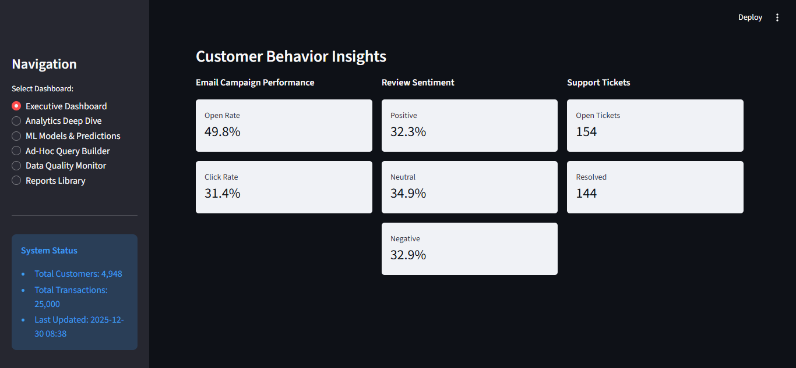
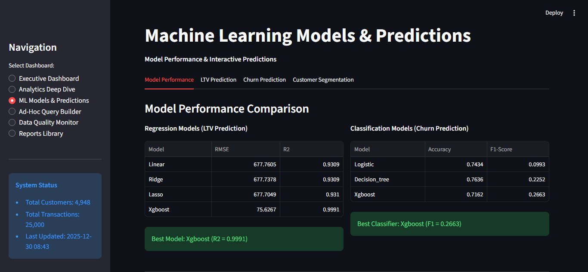
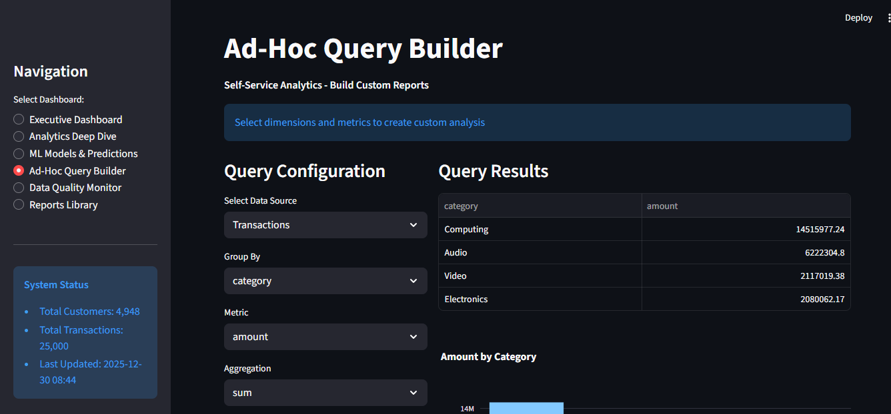

# Customer Intelligence Platform

> End-to-end Business Intelligence solution with Advanced Analytics, Machine Learning, and Interactive Dashboards

[](https://www.python.org/)
[](https://streamlit.io/)
[](LICENSE)

## Overview

A comprehensive data analytics and reporting platform that transforms raw multi-source data into actionable business insights. Built for retail companies to optimize customer intelligence through advanced analytics, predictive modeling, and interactive visualizations.

## Features

### Data Integration
- **Multi-Source ETL Pipeline**: Handles structured (SQL), semi-structured (JSON, CSV, XML), and unstructured data (text)
- **Normalized Database**: 3NF relational schema with optimized indexing
- **Data Quality Monitoring**: Automated validation and quality scoring
- **Error Handling**: Comprehensive logging and recovery mechanisms

### Advanced Analytics
- **Exploratory Data Analysis**: 7+ analytical methods including trend detection, outlier analysis, correlation studies
- **Machine Learning Models**:
  - Regression (Linear, Ridge, Lasso, XGBoost) - Customer LTV prediction
  - Classification (Logistic, Decision Trees, SVM, XGBoost) - Churn prediction
  - Clustering (K-Means) - Customer segmentation
- **Model Performance**: R² = 0.9991 for LTV prediction, 76% accuracy for churn detection

### Interactive Dashboards
- **Executive Dashboard**: High-level KPIs and business metrics
- **Analytics Deep Dive**: Comprehensive trend and pattern analysis
- **ML Predictions**: Real-time prediction interfaces
- **Ad-Hoc Query Builder**: Self-service analytics tool
- **Data Quality Monitor**: Live ETL and quality tracking
- **Reports Library**: Pre-built exportable reports

## Tech Stack

**Backend**
- Python 3.8+
- SQLite
- pandas, numpy
- scikit-learn, XGBoost
- statsmodels, scipy

**Frontend**
- Streamlit
- Plotly
- matplotlib, seaborn

## Quick Start

### Installation

```bash
# Clone repository
git clone https://github.com/hemantborana/customer-intelligence-platform.git
cd customer-intelligence-platform

# Create virtual environment
python -m venv venv
source venv/bin/activate  # On Windows: venv\Scripts\activate

# Install dependencies
pip install -r requirements.txt
```

### Setup & Run

```bash
# Step 1: Setup project structure
python setup_project.py

# Step 2: Generate sample data
python generate_data.py

# Step 3: Initialize database
python database/setup_database.py

# Step 4: Run ETL pipeline
python etl/etl_pipeline.py

# Step 5: Execute analytics
python analytics/eda_analysis.py
python analytics/ml_models.py

# Step 6: Launch dashboard
streamlit run app/streamlit_app.py
```

Access the dashboard at `http://localhost:8501`

## Project Structure

```
customer-intelligence-platform/
├── data/                      # Raw and processed data
├── database/                  # Database schema and SQLite DB
├── etl/                       # ETL pipeline scripts
├── analytics/                 # EDA and ML models
├── app/                       # Streamlit dashboard
├── requirements.txt           # Python dependencies
└── README.md                  # Documentation
```

## Data Overview

**Dataset Size**:
- 5,000 customers
- 25,000 transactions
- 1,500 reviews
- 3,000 web sessions
- 2,000 app events
- 500 email campaigns

**Data Sources**:
- Structured: Customer profiles, transactions, product catalog
- Semi-structured: Web analytics (JSON), app logs (CSV), email campaigns (XML)
- Unstructured: Customer reviews, social media, support tickets

## Key Insights

**Business Metrics**:
- Total Revenue: $24.9M
- Average Order Value: $997.41
- Customer Lifetime Value: Avg $5,037
- Monthly Growth Rate: 42.82%

**Model Performance**:
- XGBoost Regression: R² = 0.9991 (LTV prediction)
- XGBoost Classification: F1 = 0.2663 (Churn detection)
- K-Means Clustering: Silhouette Score = 0.28 (Segmentation)

**Data Quality**:
- 100% completeness (no missing values)
- 95%+ quality score across all tables
- Minimal outliers (<2%)

## Screenshots

### Executive Dashboard


### ML Predictions


### Ad-Hoc Query Builder


## Use Cases

1. **Customer Lifetime Value Prediction**: Identify high-value customers for targeted marketing
2. **Churn Prevention**: Predict and prevent customer attrition with 76% accuracy
3. **Customer Segmentation**: Group customers by behavior for personalized experiences
4. **Sales Analytics**: Track performance across channels, products, and time periods
5. **Data Quality Monitoring**: Ensure data integrity with automated quality checks

## Contributing

Contributions are welcome! Please feel free to submit a Pull Request.

1. Fork the repository
2. Create your feature branch (`git checkout -b feature/AmazingFeature`)
3. Commit your changes (`git commit -m 'Add some AmazingFeature'`)
4. Push to the branch (`git push origin feature/AmazingFeature`)
5. Open a Pull Request

## License

This project is licensed under the MIT License - see the [LICENSE](LICENSE) file for details.

## Acknowledgments

- Built as part of Data Analytics and Reporting (DAR) course
- Implements best practices from industry-standard BI platforms
- Inspired by modern data science workflows

## Contact

For questions or support:
- Create an issue in this repository
- Email: hemantpb123@gmail.com

---

**Built with ❤️ using Python, Streamlit, and Machine Learning**